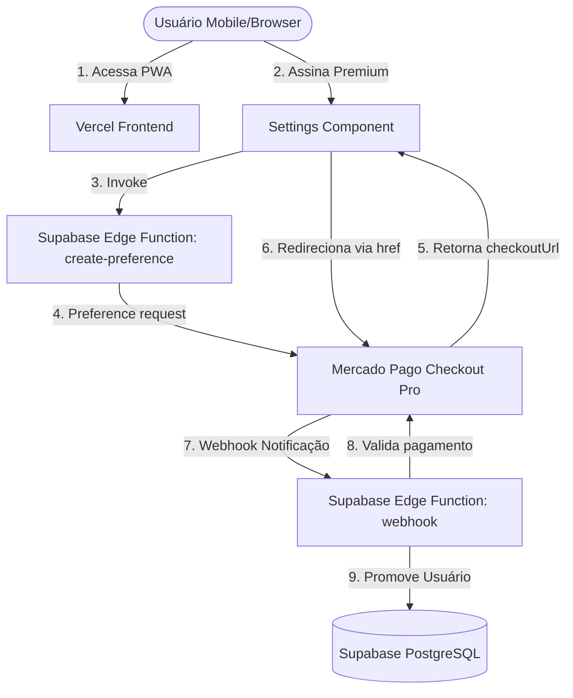

# Documentação de Integrações e Arquitetura do Cifras App

Este arquivo serve como contexto técnico e arquitetural de referência para o Gemini e desenvolvedores sobre as integrações, infraestrutura e lógica do projeto **Cifras App**.

---

## 1. Visão Geral da Arquitetura

O **Cifras App** é um aplicativo de cifragem musical estruturado como um **Vite-React-PWA** (Progressive Web App) integrado ao **Supabase** como Backend-as-a-Service e monetizado através do **Mercado Pago**.



---

## 2. Especificação das Integrações

### A. Git & GitHub (Controle de Versão)
* **Repositório**: `https://github.com/saviobpinto/cifras.git`
* **Branch Principal**: `master`
* **CI/CD Integrado**: GitHub Actions para deploy de Edge Functions e hooks do Vercel para deploy automático da aplicação.

### B. Vercel (Hospedagem Frontend)
* **Ambiente**: Produção (Vercel) rodando em [cifras-eta.vercel.app](https://cifras-eta.vercel.app).
* **Fluxo**: Qualquer `git push` para a branch `master` dispara o build automático da aplicação PWA na Vercel.

### C. Supabase (Backend & Banco de Dados)
* **URL do Projeto**: `https://zfkqvykvmstlnrziadwz.supabase.co`
* **Autenticação**: Supabase Auth (e-mail/senha).
* **Banco de Dados (PostgreSQL)**:
  * **Fallback de Assinatura**: O status de assinatura reside em dois lugares:
    1. Tabela `public.cifras_profiles` (se existir) na coluna `is_premium` (booleano).
    2. Campo `raw_user_meta_data` (JSONB) do `auth.users` contendo `{"is_premium": true}`. O app prioriza a tabela `cifras_profiles` e usa os metadados do Auth como fallback rápido e offline.
* **Supabase CLI / Deploy local**:
  * **Atenção**: O comando local `supabase` falha no macOS devido a problemas de vinculação de biblioteca (`Symbol not found: _ubrk_clone` relacionado ao ICU).
  * **Solução**: O deploy de Edge Functions é realizado **exclusivamente via GitHub Actions** pelo arquivo [.github/workflows/deploy-functions.yml](file:///.github/workflows/deploy-functions.yml).

### D. Mercado Pago (Gateway de Pagamentos)
* **Modelo de Cobrança**: Pagamento único (One-time payment) no valor de **R$ 29,90**.
* **Integração de Produção**: Utiliza o Checkout Pro.
* **Segredos configurados em Supabase** (`supabase secrets`):
  * `MERCADO_PAGO_ACCESS_TOKEN`: Token de produção do vendedor.
* **Prevenção de Auto-Pagamento**: O Mercado Pago impede a simulação de pagamentos (desabilita o botão de pagar) caso o comprador tente pagar logado com a mesma conta que gerou as credenciais (vendedor). Os testes em sandbox/produção exigem uma aba anônima ou conta secundária de testes.

---

## 3. Fluxo de Pagamento & Edge Functions

O Supabase gerencia duas Edge Functions (`/supabase/functions`):

1. **`create-preference`**:
   * Chamado diretamente do componente de configurações ([Settings.jsx](file:///src/components/Settings.jsx)) após o login.
   * Recebe o `userId` e o `email`.
   * Cria uma preferência no Mercado Pago utilizando o endpoint correto (`https://api.mercadopago.com/checkout/preferences`) e anexa o ID do usuário no campo `external_reference`.
   * Retorna a `checkoutUrl` (`init_point` do Mercado Pago).

2. **`mercado-pago-webhook`**:
   * Configurado como webhook nas configurações de desenvolvedor do Mercado Pago para eventos de pagamento (`payment.created`, `payment.updated`).
   * Recebe a notificação de pagamento, obtém os detalhes via API do Mercado Pago por segurança, valida se o status é `approved` e lê o ID do usuário no `external_reference`.
   * **Promoção**:
     * Tenta atualizar a coluna `is_premium = true` na tabela `cifras_profiles`.
     * Executa `supabase.auth.admin.updateUserById` para atualizar os metadados `user_metadata.is_premium = true` no Auth (garante acesso offline/fallback).

---

## 4. Regras e Restrições de Uso (Premium vs Grátis)

A lógica do aplicativo impõe limites estritos aos usuários sem assinatura Premium:

| Funcionalidade | Usuário Gratuito | Usuário Premium |
| :--- | :--- | :--- |
| **Limite de Músicas** | Máximo de **30 músicas** na biblioteca local | Músicas ilimitadas |
| **Sincronização em Nuvem** | Bloqueada (visualizado com cadeado) | Sincronização automática e manual ativa |
| **Backup (Importar/Exportar)** | Bloqueado (botões trancados) | Permissão de importação/exportação irrestrita |
| **Importação de Catálogo** | Importa apenas 30 músicas de forma aleatória | Importação do catálogo completo |
| **Modo Offline** | Acesso negado. Exige internet no login | Acesso offline irrestrito via dados cacheados |

### Tratamento de Redirects Mobile (Importante)
Em dispositivos móveis (Safari, Chrome mobile), chamadas de `window.open` disparadas dentro de promessas assíncronas (como o `await fetch/supabase.invoke`) são barradas pelos bloqueadores de pop-up nativos.
* **Regra de Implementação**: Use sempre redirecionamentos diretos na mesma janela para páginas externas de checkout:
  ```javascript
  // Correto para Fluxos Mobile:
  window.location.href = data.checkoutUrl;
  ```

---

## 5. Próximas Evoluções Técnicas Recomendadas

1. **Validação de Webhooks (Assinatura)**:
   * Atualmente, o webhook do Mercado Pago aceita requisições diretas. Para segurança total em ambiente de produção, implemente a verificação de assinatura SHA256 usando a chave do cabeçalho `x-signature` enviada pelo Mercado Pago para evitar requisições forjadas.

2. **Criação Automática da Tabela `cifras_profiles`**:
   * Caso queira utilizar tabelas relacionais em vez de apenas metadados do Auth, crie a tabela `public.cifras_profiles` no Supabase com Row Level Security (RLS) habilitada para que os usuários só visualizem seu próprio perfil.

3. **Mecanismo de Sincronização Incremental (Offline-First)**:
   * Implementar controle de concorrência com timestamp de atualização (`updated_at` / `deleted_at`) para evitar perda de dados quando o usuário editar músicas offline em múltiplos dispositivos.

4. **Tratamento de Service Workers (PWA Update UX)**:
   * Adicionar um aviso visual (Prompt/Toast) no app sempre que um novo build da Vercel for publicado, instigando o usuário a atualizar o PWA e recarregar os assets atualizados do cache offline do Service Worker.
