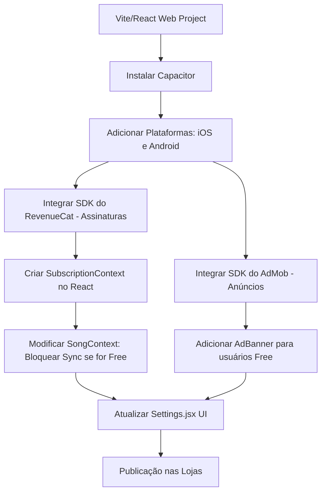

# Plano de Publicação nas Lojas (App Store & Google Play)

Este documento detalha o passo a passo para transformar o seu projeto de cifras (atualmente um aplicativo web React/Vite/PWA) em aplicativos nativos para iOS e Android, implementando um modelo de monetização híbrido:
1. **Plano Gratuito**: Exibição de anúncios e sincronização em nuvem desativada.
2. **Plano Anual (Premium)**: Sem anúncios e sincronização/backup em nuvem (Supabase) ativada.

---

## User Review Required

> [!IMPORTANT]
> **Políticas de Faturamento das Lojas:**
> Para comercializar assinaturas de serviços digitais (como o Plano Anual com Backup) em aplicativos nas lojas da Apple e do Google, **você é obrigado a utilizar o sistema de faturamento nativo** (In-App Purchases / Subscriptions). O uso de outros meios de pagamento (como Stripe, Pix ou links externos) para recursos digitais é proibido e resultará na rejeição ou remoção imediata do seu aplicativo.

> [!WARNING]
> **Custos de Contas de Desenvolvedor:**
> - **Apple Developer Program:** US$ 99 por ano (necessário para publicar no iOS/App Store).
> - **Google Play Console:** US$ 25 (taxa única, necessária para publicar no Android/Play Store).

> [!NOTE]
> **Ferramentas Recomendadas para Integração:**
> - **Capacitor (da Ionic):** Ferramenta ideal para empacotar o código React/Vite existente em projetos Xcode (iOS) e Android Studio.
> - **RevenueCat:** Uma plataforma (com plano gratuito muito generoso) que simplifica drasticamente a implementação de compras e assinaturas nas duas lojas, lidando com validação de recibos, restauração de compras e sincronização com o app por meio de um SDK simples para Capacitor.
> - **AdMob (Google):** Plataforma para exibir anúncios mobile.

---

## Open Questions

> [!IMPORTANT]
> Para ajustar os detalhes do plano, por favor, considere as seguintes questões:
> 1. Você já possui as contas de desenvolvedor criadas na **Apple** e no **Google**?
> 2. Você possui um domínio web próprio (ex: `seusite.com.br`)? Ele é necessário para hospedar a **Política de Privacidade** (exigida pelas duas lojas) e o arquivo `app-ads.txt` (exigido pelo AdMob para verificar a propriedade do seu app de anúncios).
> 3. Que tipo de formato de anúncio prefere exibir na versão gratuita (ex: um Banner fixo na parte inferior da tela, anúncios de página inteira/Interstitials ao abrir setlists, ou ambos)?

---

## Proposed Changes

Para alcançar esse objetivo, precisaremos fazer alterações estruturais e de código. A seguir, detalhamos cada uma dessas etapas:



### 1. Mobile Wrapper Setup (Capacitor)

Precisamos inicializar o Capacitor no seu projeto atual para que ele gere os apps nativos baseados na pasta de build (`dist/`).

#### [NEW] [capacitor.config.json](file:///Users/saviobpinto/Documents/workspace/cifras/capacitor.config.json)
Arquivo de configuração do Capacitor que define o Bundle ID (identificador único do seu app, ex: `com.savio.cifras`) e o diretório dos arquivos compilados.

#### [MODIFY] [package.json](file:///Users/saviobpinto/Documents/workspace/cifras/package.json)
Adição de scripts e dependências necessárias do Capacitor e de plugins nativos:
- `@capacitor/core` e `@capacitor/cli`
- `@capacitor/ios` e `@capacitor/android`
- `@capacitor-community/admob` (Anúncios Google AdMob)
- `@revenuecat/purchases-capacitor` (Assinatura e In-App Purchases)

---

### 2. Subscription Management (RevenueCat Integration)

Criaremos um contexto de assinatura para gerenciar se o usuário atual é "Premium" ou "Free".

#### [NEW] [SubscriptionContext.jsx](file:///Users/saviobpinto/Documents/workspace/cifras/src/contexts/SubscriptionContext.jsx)
Este contexto será responsável por:
1. Inicializar o SDK do RevenueCat.
2. Identificar o usuário (ligando o ID do usuário do Supabase ao RevenueCat).
3. Verificar se o usuário possui a assinatura anual ativa (`entitlement` premium).
4. Fornecer funções para iniciar a compra da assinatura anual e restaurar compras anteriores.

```javascript
// Exemplo conceitual da lógica de validação:
export function SubscriptionProvider({ children }) {
    const [isPremium, setIsPremium] = useState(false);
    
    // RevenueCat listener
    useEffect(() => {
        // Verifica o estado da assinatura no RevenueCat
        Purchases.addCustomerInfoUpdateListener((info) => {
            const premiumActive = info.entitlements.active['PremiumAnual'] !== undefined;
            setIsPremium(premiumActive);
        });
    }, []);

    return (
        <SubscriptionContext.Provider value={{ isPremium, buySubscription, restorePurchases }}>
            {children}
        </SubscriptionContext.Provider>
    );
}
```

#### [MODIFY] [main.jsx](file:///Users/saviobpinto/Documents/workspace/cifras/src/main.jsx)
Envolver o aplicativo com o novo `SubscriptionProvider`, permitindo que qualquer tela ou lógica consulte o status da assinatura do usuário.

---

### 3. Feature Gating & Ad Display (Adaptações no Código)

#### [MODIFY] [SongContext.jsx](file:///Users/saviobpinto/Documents/workspace/cifras/src/contexts/SongContext.jsx)
Ajustar a lógica de sincronização com o Supabase para que ela seja bloqueada se o usuário for do plano gratuito.

```diff
     const manualSync = async () => {
+        if (!isPremium) {
+            setSyncProgress({ isSyncing: false, progress: 0, statusText: 'Backup em nuvem requer assinatura Premium.' });
+            return;
+        }
         if (!session?.user || isOfflineMode) return;
```
Também devemos desativar a sincronização automática em segundo plano (`syncRowToCloud`) se o usuário for gratuito.

#### [NEW] [AdBanner.jsx](file:///Users/saviobpinto/Documents/workspace/cifras/src/components/AdBanner.jsx)
Componente de Banner que carrega e exibe o anúncio AdMob caso o usuário não seja Premium. Ele será embutido no layout global (ex: no rodapé da página de visualização de cifras ou na biblioteca).

#### [MODIFY] [Settings.jsx](file:///Users/saviobpinto/Documents/workspace/cifras/src/components/Settings.jsx)
- Adicionar uma seção visual premium destacando as vantagens do plano Premium (Sem anúncios + Backup em nuvem).
- Exibir botões para "Assinar Plano Anual" ou "Restaurar Compra".
- Desabilitar ou colocar um ícone de cadeado na opção de "Sincronização" se o usuário for gratuito, convidando-o a assinar quando clicar.

---

## Verification Plan

### Automated & Simulator Tests
1. **Ambiente de Testes do RevenueCat (Sandbox):**
   - No iOS: Utilizaremos arquivos `.storekit` localmente ou contas de sandbox do App Store Connect para testar o fluxo de compra da assinatura sem gastar dinheiro real.
   - No Android: Usaremos licenças de teste no Google Play Console para simular compras.
2. **Ambiente de Testes do AdMob:**
   - Usaremos os IDs de teste padrão fornecidos pelo AdMob (`ca-app-pub-3940256099942544/2934735716` para Banner) durante o desenvolvimento para validar se os anúncios aparecem e se comportam de forma responsiva sem gerar cliques falsos reais.

### Manual Verification
- Compilar o projeto (`npm run build`).
- Sincronizar com os emuladores (`npx cap sync ios` e `npx cap sync android`).
- Rodar o app no simulador de iOS (via Xcode) e Android (via Android Studio).
- Verificar se o AdBanner é exibido apenas quando o status `isPremium` é falso.
- Tentar realizar a sincronização na nuvem com uma conta gratuita e verificar se o sistema bloqueia e solicita a assinatura.
- Simular a compra do Plano Premium, confirmar se os anúncios somem imediatamente e o botão de sincronização é liberado.

---

## App Store & Google Play Publishing Checklist

Aqui está o passo a passo detalhado do que você precisa fazer nas plataformas de desenvolvedor para colocar o projeto no ar:

### Passo 1: Preparação da Infraestrutura Comum
1. **Domínio e Políticas:** Crie um site simples (pode ser uma landing page estática) com:
   - Política de Privacidade (obrigatório).
   - Termos de Uso (EULA) para iOS (obrigatório).
   - Um arquivo `app-ads.txt` na raiz do domínio para o AdMob.
2. **Configuração do Google AdMob:**
   - Crie uma conta no Google AdMob.
   - Registre um aplicativo iOS e outro Android no painel.
   - Crie um bloco de anúncio do tipo **Banner** para cada plataforma e guarde os IDs dos blocos.

### Passo 2: Configuração na Apple App Store (iOS)
1. **Conta:** Adquira a assinatura do Apple Developer Program.
2. **App Store Connect:**
   - Crie um novo app informando o nome, idioma e o Bundle ID.
   - Configure o **In-App Purchase**: Crie um produto do tipo **Subscription (Assinatura)** Auto-renovável. Defina o ID do produto (ex: `com.savio.cifras.anual`), preço (ex: R$ 49,90/ano) e localize o nome comercial da assinatura.
   - Configure o grupo de assinaturas e a duração (1 ano).
3. **Xcode & Build:**
   - Rode `npx cap open ios` para abrir o Xcode.
   - Configure o **Signing & Capabilities** com a sua conta de desenvolvedor para assinar o app.
   - Adicione suporte a In-App Purchase nas capacidades do projeto.
   - Gere os ícones do aplicativo e telas de início (Splash Screen).
   - Selecione a opção **Product > Archive** no Xcode e faça o envio para a nuvem.
4. **Submissão:**
   - No App Store Connect, selecione a build enviada.
   - Adicione prints do app (tamanhos de tela de iPhone de 6.5" e 5.5" são obrigatórios).
   - Preencha a descrição, palavras-chave, site de suporte e a URL da Política de Privacidade.
   - Vincule a Assinatura Anual para ser revisada junto com o primeiro envio do app.
   - Envie para a revisão da Apple.

### Passo 3: Configuração no Google Play Store (Android)
1. **Conta:** Crie sua conta de desenvolvedor no Google Play Console.
2. **Play Console:**
   - Crie um aplicativo e defina-o como **App** e **Pago** (pois terá compras internas).
   - Preencha o questionário de classificação de conteúdo, público-alvo e categoria.
   - Configure a Política de Privacidade.
   - Vá em **Produtos Monetizados > Assinaturas** e crie uma assinatura com ID do produto (ex: `com.savio.cifras.anual`), insira o preço anual correspondente e configure o período de cobrança.
3. **Android Studio & Build:**
   - Rode `npx cap open android` para abrir o projeto no Android Studio.
   - Configure a assinatura de lançamento criando um arquivo Keystore (`.jks`).
   - Adicione os ícones do app.
   - Gere o arquivo final compilando em formato **Android App Bundle (.aab)** em *Build > Generate Signed Bundle/APK*.
4. **Submissão:**
   - Faça upload do arquivo `.aab` em uma faixa de teste interno ou de produção no Play Console.
   - Adicione prints de tela (mínimo de 4 fotos em formato celular e tablet).
   - Forneça dados de acesso de teste se o app exigir login (forneça um usuário/senha do Supabase de teste).
   - Envie para revisão da Google.

### Passo 4: Ligação com o RevenueCat
1. Crie um projeto no RevenueCat.
2. Adicione as plataformas **App Store** (usando a Shared Secret gerada no App Store Connect) e **Play Store** (usando a chave de API/service account do Google Cloud configurada no Google Play Console).
3. Crie uma **Entitlement** (ex: `premium`).
4. Crie um **Offering** (ex: `default_offering`) contendo o pacote anual (Packages) e associe o pacote aos IDs dos produtos criados nas lojas (Apple e Google).
5. O SDK no app fará a busca automatizada desses produtos direto do RevenueCat, simplificando tudo!
