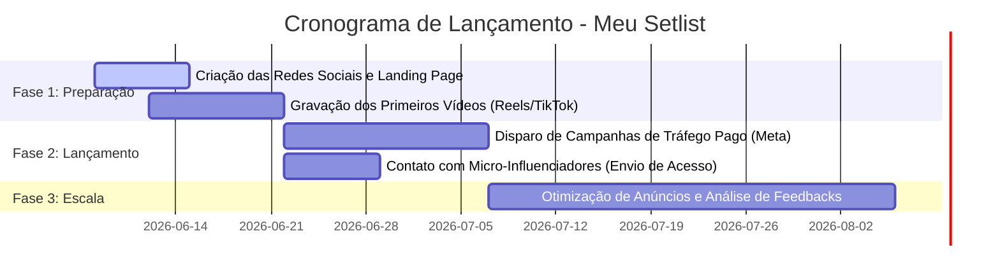

# Plano de Marketing Digital: Meu Setlist

Este documento detalha o plano de marketing estratégico para lançar e divulgar o aplicativo **Meu Setlist** no mercado brasileiro, com foco em violonistas, guitarristas, baixistas e outros músicos que tocam ao vivo (barzinhos, casamentos, igrejas, bandas).

---

## 1. Posicionamento e Proposta de Valor

O **Meu Setlist** resolve dores reais que músicos enfrentam antes e durante suas apresentações. Para se destacar em um mercado competitivo, focaremos nas seguintes vantagens:

* **Dor do Cliente**: Internet caindo no meio do show, pastas pesadas de papel, falta de organização do repertório, e assinaturas mensais caras de aplicativos de cifras.
* **Solução (Meu Setlist)**: 
  * **Offline-First Total**: Acesso garantido às cifras e setlists mesmo sem sinal de internet.
  * **Tudo em Um**: Afinador e Metrônomo de alta precisão integrados diretamente no app.
  * **Preço Justo (Pagamento Único)**: Modelo de cobrança de **R$ 29,90 (taxa única)** em vez de mensalidades recorrentes. Isso é um enorme diferencial de vendas no Brasil.
  * **Sem Fricção (PWA)**: Instalação instantânea pelo navegador, sem necessidade imediata de baixar pela App Store/Play Store.

---

## 2. Perfil do Público-Alvo (Persona)

1. **O Músico de Barzinho (Foco Principal)**:
   * *Perfil*: Toca profissionalmente ou por hobby em bares, restaurantes e eventos.
   * *Necessidade*: Precisa de rapidez para achar músicas pedidas pelo público e organizar a sequência do show (Setlist) sem falhas de conexão.
2. **O Líder de Ministério/Worship**:
   * *Perfil*: Organiza as músicas da igreja semanalmente e ensaia com a equipe.
   * *Necessidade*: Compartilhar setlists e transpor tons de forma rápida.
3. **O Músico Amador / Estudante**:
   * *Perfil*: Toca em reuniões familiares, churrascos ou está aprendendo violão.
   * *Necessidade*: Acesso fácil a um catálogo grande (mais de 30 mil cifras) e ferramentas como afinador e metrônomo para praticar.

---

## 3. Estratégia de Aquisição de Tráfego

### A. Marketing de Conteúdo e Vídeos Curtos (Orgânico)
Os vídeos curtos (Reels, TikTok, Shorts) são hoje a forma mais barata e rápida de viralizar e alcançar milhares de músicos no Brasil.

* **Linhas Editoriais Recomendadas**:
  * **"Perrengues de Músico"**: Vídeos humorísticos mostrando a pasta de papel rasgando com o vento no show, ou o tablet travando porque a internet do bar caiu. Mostre a transição para o *Meu Setlist* operando em Modo Avião.
  * **Demonstração Rápida**: Vídeos curtos mostrando como é fácil mudar o tom de uma música com 1 clique ou usar o afinador integrado.
  * **Comparativos**: "Por que eu parei de pagar assinatura mensal para cifrar minhas músicas" (destacando o preço único de R$ 29,90).

### B. Parcerias com Micro-Influenciadores (Custo Baixo/Médio)
Músicos confiam muito em indicações de outros músicos e professores.

* **Ação**: Fazer um mapeamento no Instagram e YouTube de professores de violão/guitarra e músicos independentes com 5 mil a 50 mil seguidores.
* **Oferta**: Enviar acesso Premium gratuito para que eles testem o aplicativo em seus shows e gravem um Stories ou Reels mostrando o app em ação (com link de afiliado ou cupom de desconto).

### C. Tráfego Pago (Meta Ads & Google Ads)
Focado no público brasileiro interessado em instrumentos musicais.

* **Meta Ads (Instagram/Facebook)**:
  * *Público*: Interesses em "Violão", "Guitarra", "Cifra Club", "Música ao vivo", "Banda".
  * *Criativos*: Vídeos mostrando a tela do celular com o setlist rodando offline e o afinador. Textos diretos: *"Chega de carregar pastas de papel ou ficar sem cifras quando a internet cai. Tenha mais de 30 mil cifras no bolso por um único pagamento de R$ 29,90. Instale agora!"*
* **Google Ads (Pesquisa & App)**:
  * *Palavras-chave*: "organizador de setlist", "app de cifras offline", "como organizar repertório de show", "afinador violão online".

### D. Presença em Comunidades e Fóruns
* Publicações nativas e úteis em grupos de músicos no Facebook, fóruns de música e grupos de WhatsApp/Telegram de ministérios de louvor, oferecendo dicas de organização de shows e apresentando o app como uma ferramenta gratuita (com o gancho do Premium para backup).

---

## 4. Funil de Conversão e Monetização

* **Atração**: O usuário acessa o PWA de forma gratuita (versão grátis limitada a 30 músicas).
* **Ativação**: O usuário adiciona suas primeiras músicas e testa a interface em um ensaio ou show curto.
* **Retenção**: Uso diário das ferramentas gratuitas (Afinador e Metrônomo) e facilidade de busca.
* **Conversão (Premium)**:
  * Quando o usuário tenta importar o catálogo de 30 mil músicas, o app exibe o bloqueio com a oferta Premium.
  * Quando ele precisa de backup em nuvem para não perder os dados.
  * **Gatilho de Escassez**: Exibir o preço de R$ 29,90 como *"Oferta Especial de Lançamento (Pagamento Único)"*, sugerindo que futuramente o aplicativo adotará um modelo de assinatura recorrente.

---

## 5. Cronograma de Ações de Lançamento

---

## 6. Próximos Passos Recomendados para o Produto
Para apoiar a estratégia de marketing, considere:
1. **Compartilhamento de Setlists**: Permitir que um usuário Premium gere um link (ou PDF formatado) do setlist para enviar aos outros integrantes da banda. Isso gera marketing boca a boca viral de forma orgânica.
2. **Programa de Indicação**: *"Indique para 3 amigos músicos e ganhe 1 mês de backup em nuvem grátis"* (se futuramente migrar para mensalidades) ou libere recursos extras.
